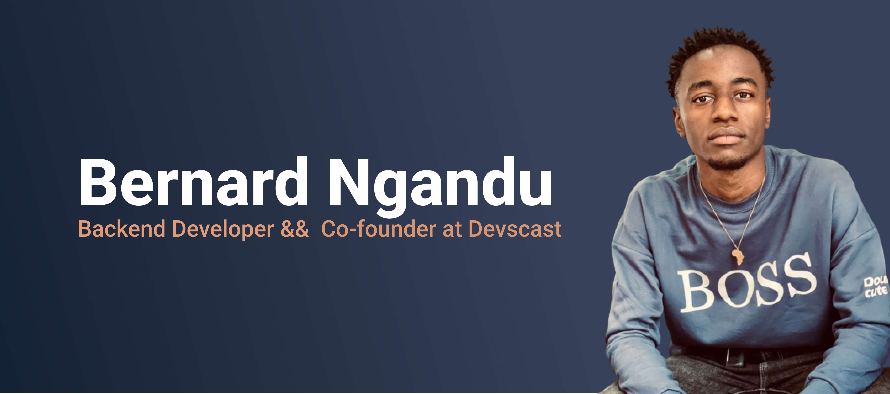

## About Me

My dream is to gain the freedom to help people through new products, to help them grow through experience and to realize their dreams and independence. For me, software development is a form of expression, nor can I agree that software development is an art.

Skills: Web, PHP - SYMFONY

Currently Learning : DV, DA & Machine Learning

## Let's get in touch

